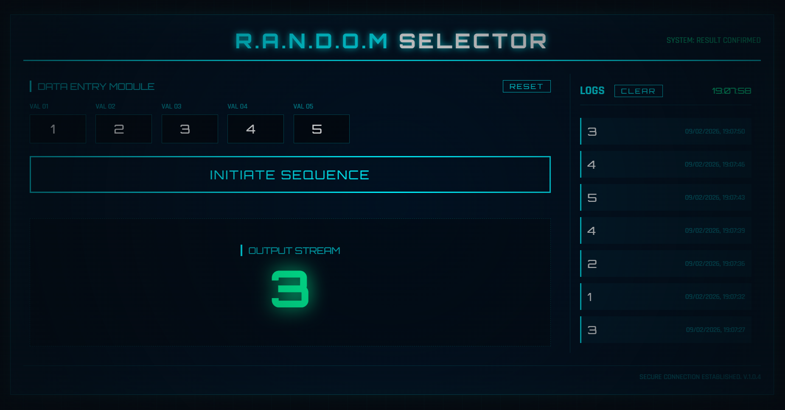

# R.A.N.D.O.M Selector (HUD)

A futuristic HUD-style random selector with dynamic inputs, selection animation, and local history storage.



## Features

- Custom slot count (2 to 100)
- Automatic input field generation
- Numeric value selection
- Animated selection process
- Result history (up to 50 entries)
- Sci-fi terminal-style interface

## Project Structure

- `index.html` — main interface
- `style.css` — layout, styles, and animations
- `script.js` — core logic and history system

## How to Use

1. Download or clone the project
2. Open `index.html` in your browser
3. Set the number of slots
4. Enter the values
5. Click **INITIATE SEQUENCE** to run the selection

## How the Selection Works

1. The user sets the number of slots
2. The system generates the input fields
3. Only values between **0 and 50** are accepted
4. At least **2 valid values** are required
5. The system runs a short animation
6. A final value is selected
7. The result is saved in the history

### Smart Random Logic
The system attempts to avoid repeating the last 5 results if other options are available.

## Customization

### Change value limits
In `script.js`, edit:
- the validation range (0–50)
- the `max` attribute in generated inputs

### Change colors and theme
In `style.css`, edit the variables inside `:root`:

```css
--primary-color
--secondary-color
--bg-color
--panel-bg
